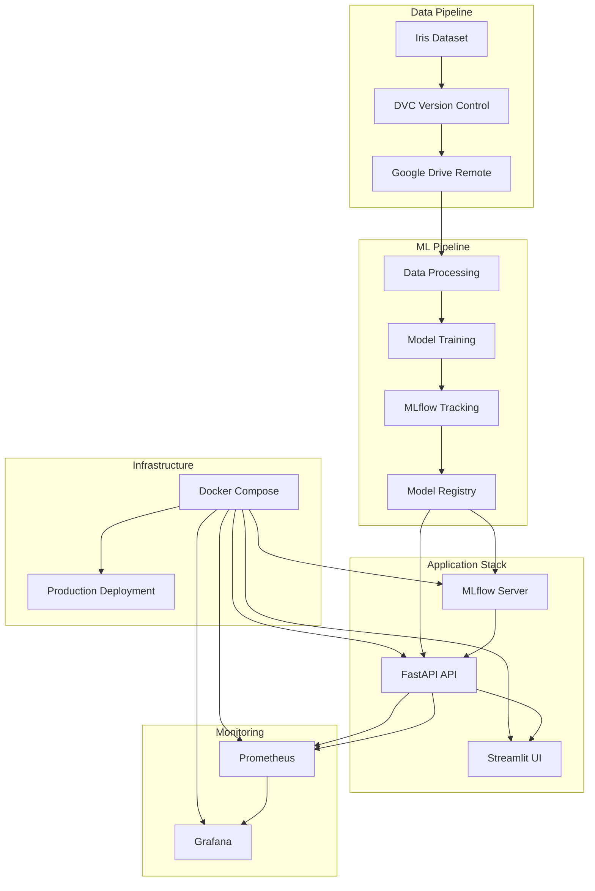

# 🌸 MLOps Assignment - Complete ML Pipeline with Docker

[](https://github.com/zanjesud/mlops-assignment/actions/workflows/ci-cd.yml)
[](https://hub.docker.com/r/zanjesud/mlops-assignment)
[](https://www.python.org/downloads/)
[](https://opensource.org/licenses/MIT)

A comprehensive MLOps pipeline demonstrating **Data Version Control (DVC)**, **MLflow model tracking**, **FastAPI REST API**, **Streamlit UI**, **Docker containerization**, **Prometheus monitoring**, and **Grafana visualization** for an Iris classification model.

## 🎯 Project Overview

This project showcases a complete MLOps workflow from data ingestion to production deployment, including:

- 📊 **Data Version Control** with DVC and Google Drive
- 🤖 **Machine Learning** with scikit-learn and MLflow
- 🚀 **REST API** with FastAPI and Prometheus metrics
- 🎨 **Web UI** with Streamlit
- 🐳 **Containerization** with Docker and Docker Compose
- 📈 **Monitoring** with Prometheus and Grafana
- 🔄 **CI/CD** with GitHub Actions
- 🧪 **Testing** with pytest and coverage reporting

## 🏗️ Architecture



## 🚀 Quick Start

### Prerequisites

- **Docker & Docker Compose** - [Install Docker](https://docs.docker.com/get-docker/)
- **Python 3.11+** - [Download Python](https://www.python.org/downloads/)
- **Git** - [Install Git](https://git-scm.com/downloads)
- **UV Package Manager** - [Install UV](https://docs.astral.sh/uv/getting-started/installation/)

### 🐳 Option 1: Docker (Recommended)

```bash
# Clone the repository
git clone https://github.com/zanjesud/mlops-assignment.git
cd mlops-assignment

# Build and start all services
docker-compose up --build

# Or run in background
docker-compose up -d --build
```

### 🐍 Option 2: Local Development

```bash
# Clone and setup
git clone https://github.com/zanjesud/mlops-assignment.git
cd mlops-assignment

# Install dependencies
uv venv
source .venv/bin/activate  # On Windows: .venv\Scripts\activate
uv pip install -e .

# Initialize DVC and download data
dvc init
dvc pull

# Start services
mlflow server --host 0.0.0.0 --port 5000 &
uvicorn api.main:app --reload --host 0.0.0.0 --port 8000 &
streamlit run ui/app.py --server.port 8501
```

### 🌐 Access Services

| Service | URL | Description |
|---------|-----|-------------|
| **Streamlit UI** | http://localhost:8501 | Interactive web interface |
| **FastAPI API** | http://localhost:8000 | REST API endpoints |
| **API Docs** | http://localhost:8000/docs | Interactive API documentation |
| **MLflow UI** | http://localhost:5000 | Model tracking and registry |
| **Prometheus** | http://localhost:9090 | Metrics collection |
| **Grafana** | http://localhost:3000 | Metrics visualization (admin/admin) |

## 📋 Step-by-Step Implementation Guide

### 1. 🛠️ Project Setup & Data Version Control

#### Initialize Project with UV
```bash
# Create new project
uv init mlops-assignment
cd mlops-assignment

# Setup virtual environment
uv venv
source .venv/bin/activate  # Windows: .venv\Scripts\activate
```

#### Git & DVC Setup
```bash
# Initialize Git
git init
git add .
git commit -m "Initial commit"

# Install DVC dependencies
uv add dvc dvc-gdrive mlflow

# Initialize DVC
dvc init
```

#### Google Drive Remote Setup
```bash
# Add Google Drive as remote storage
dvc remote add --default gdrive gdrive://14v9yGR-7czWk9DnTUPvd2Gp1xSPoeHug
dvc remote modify gdrive gdrive_acknowledge_abuse true

# Setup Google Cloud OAuth (follow DVC docs)
# https://dvc.org/doc/user-guide/data-management/remote-storage/google-drive
dvc remote modify gdrive gdrive_client_id 'your-client-id'
dvc remote modify gdrive gdrive_client_secret 'your-client-secret'
```

#### Data Pipeline
```bash
# Create data structure
mkdir -p data/raw data/processed

# Install data processing dependencies
uv add pandas scikit-learn

# Create dataset script
cat > data/make_dataset.py << 'EOF'
import pandas as pd
from sklearn.datasets import load_iris

def save_raw():
    iris = load_iris(as_frame=True)
    df = pd.concat([iris.data, pd.Series(iris.target, name="target")], axis=1)
    df.to_csv("data/raw/iris.csv", index=False)

if __name__ == "__main__":
    save_raw()
EOF

# Generate and version data
python data/make_dataset.py
dvc add data/raw/iris.csv
git add data/raw/iris.csv.dvc
git commit -m "Add iris dataset"
dvc push
```

### 2. 🤖 Model Training & MLflow Integration

#### Setup MLflow
```bash
# Start MLflow server
mlflow server --host 127.0.0.1 --port 5000 &

# Or with database backend
mlflow server --backend-store-uri sqlite:///mlflow.db --default-artifact-root ./mlruns &
```

#### Model Training
```bash
# Create training script
mkdir models
cat > models/train.py << 'EOF'
import click
import mlflow
import pandas as pd
from sklearn.ensemble import RandomForestClassifier
from sklearn.model_selection import train_test_split
from sklearn.metrics import accuracy_score

@click.command()
@click.option("--model_type", default="rf", help="Model type")
@click.option("--random_state", default=42, help="Random state")
def train(model_type, random_state):
    mlflow.set_experiment("iris-classifier")
    
    with mlflow.start_run():
        # Load data
        df = pd.read_csv("data/raw/iris.csv")
        X, y = df.drop("target", axis=1), df["target"]
        X_train, X_test, y_train, y_test = train_test_split(
            X, y, test_size=0.2, random_state=random_state
        )
        
        # Train model
        model = RandomForestClassifier(random_state=random_state)
        model.fit(X_train, y_train)
        
        # Evaluate
        y_pred = model.predict(X_test)
        accuracy = accuracy_score(y_test, y_pred)
        
        # Log metrics
        mlflow.log_metric("accuracy", accuracy)
        mlflow.sklearn.log_model(model, "model")

if __name__ == "__main__":
    train()
EOF

# Train models
python models/train.py --model_type=rf --random_state=42
python models/train.py --model_type=rf --random_state=100
```

#### Model Promotion System
```bash
# Create promotion scripts
cat > models/promote_model.py << 'EOF'
import click
import mlflow
from mlflow.tracking import MlflowClient

@click.group()
def cli():
    pass

@cli.command()
def list_models():
    client = MlflowClient()
    for model in client.list_registered_models():
        print(f"Model: {model.name}")

@cli.command()
@click.option("--run-id", required=True)
def promote_to_staging(run_id):
    client = MlflowClient()
    client.create_model_version(
        name="iris_classifier",
        source=f"runs:/{run_id}/model",
        run_id=run_id
    )
    print(f"Promoted run {run_id} to staging")

if __name__ == "__main__":
    cli()
EOF

# Usage examples
python models/promote_model.py list-models
python models/promote_model.py promote-to-staging --run-id 'your-run-id'
```

### 3. 🚀 API & UI Development

#### FastAPI Application
```bash
# Install API dependencies
uv add fastapi uvicorn prometheus-fastapi-instrumentator

# Create API structure
mkdir api
cat > api/main.py << 'EOF'
import mlflow.pyfunc
import pandas as pd
from fastapi import FastAPI
from prometheus_fastapi_instrumentator import Instrumentator

app = FastAPI(title="Iris Classifier API")
Instrumentator().instrument(app).expose(app)

@app.get("/health")
def health_check():
    return {"status": "healthy"}

@app.post("/predict")
def predict(features: dict):
    model = mlflow.pyfunc.load_model("models:/iris_classifier@production")
    df = pd.DataFrame([features])
    prediction = model.predict(df)
    return {"prediction": prediction.tolist()}
EOF
```

#### Streamlit UI
```bash
# Install UI dependencies
uv add streamlit

# Create UI
mkdir ui
cat > ui/app.py << 'EOF'
import streamlit as st
import requests

st.title("Iris Classifier")
st.write("Enter iris measurements to predict species")

sepal_length = st.slider("Sepal Length", 4.0, 8.0, 5.4)
sepal_width = st.slider("Sepal Width", 2.0, 5.0, 3.4)
petal_length = st.slider("Petal Length", 1.0, 7.0, 4.7)
petal_width = st.slider("Petal Width", 0.1, 2.5, 1.4)

if st.button("Predict"):
    response = requests.post(
        "http://localhost:8000/predict",
        json={
            "sepal_length": sepal_length,
            "sepal_width": sepal_width,
            "petal_length": petal_length,
            "petal_width": petal_width
        }
    )
    if response.status_code == 200:
        prediction = response.json()["prediction"]
        st.success(f"Predicted species: {prediction}")
EOF
```

### 4. 🐳 Dockerization

#### Multi-stage Dockerfile
```dockerfile
# Base stage
FROM python:3.11-slim as base
WORKDIR /app
RUN pip install uv
COPY pyproject.toml uv.lock ./
RUN uv pip install --system .

# API stage
FROM base as api
COPY api/ ./api/
COPY models/ ./models/
EXPOSE 8000
CMD ["uvicorn", "api.main:app", "--host", "0.0.0.0", "--port", "8000"]

# UI stage
FROM base as ui
COPY ui/ ./ui/
EXPOSE 8501
CMD ["streamlit", "run", "ui/app.py", "--server.port", "8501", "--server.address", "0.0.0.0"]

# MLflow stage
FROM base as mlflow
EXPOSE 5000
CMD ["mlflow", "server", "--host", "0.0.0.0", "--port", "5000"]
```

#### Docker Compose
```yaml
version: '3.8'
services:
  mlflow:
    build:
      context: .
      dockerfile: Dockerfile
      target: mlflow
    ports:
      - "5000:5000"
    volumes:
      - ./mlruns:/app/mlruns

  api:
    build:
      context: .
      dockerfile: Dockerfile
      target: api
    ports:
      - "8000:8000"
    depends_on:
      - mlflow

  ui:
    build:
      context: .
      dockerfile: Dockerfile
      target: ui
    ports:
      - "8501:8501"
    depends_on:
      - api

  prometheus:
    image: prom/prometheus:latest
    ports:
      - "9090:9090"
    volumes:
      - ./monitoring/prometheus.yml:/etc/prometheus/prometheus.yml

  grafana:
    image: grafana/grafana:latest
    ports:
      - "3000:3000"
    environment:
      - GF_SECURITY_ADMIN_PASSWORD=admin
```

### 5. 📊 Monitoring & Observability

#### Prometheus Configuration
```yaml
# monitoring/prometheus.yml
global:
  scrape_interval: 15s

scrape_configs:
  - job_name: 'fastapi-app'
    static_configs:
      - targets: ['api:8000']
    metrics_path: '/metrics'
```

#### Grafana Dashboard
```json
{
  "dashboard": {
    "title": "MLOps Dashboard",
    "panels": [
      {
        "title": "API Request Rate",
        "type": "graph",
        "targets": [
          {
            "expr": "rate(http_requests_total[5m])",
            "legendFormat": "{{method}} {{endpoint}}"
          }
        ]
      }
    ]
  }
}
```

### 6. 🧪 Testing & Quality Assurance

#### Test Setup
```bash
# Install testing dependencies
uv add pytest pytest-cov httpx

# Create test configuration
cat > pytest.ini << 'EOF'
[pytest]
pythonpath = .
testpaths = tests
addopts = --cov=api --cov-report=html
EOF

# Create tests
mkdir tests
cat > tests/test_api.py << 'EOF'
import pytest
from fastapi.testclient import TestClient
from api.main import app

client = TestClient(app)

def test_health_check():
    response = client.get("/health")
    assert response.status_code == 200
    assert response.json()["status"] == "healthy"

def test_predict():
    response = client.post("/predict", json={
        "sepal_length": 5.1,
        "sepal_width": 3.5,
        "petal_length": 1.4,
        "petal_width": 0.2
    })
    assert response.status_code == 200
    assert "prediction" in response.json()
EOF
```

#### Code Quality Tools
```bash
# Install linting tools
uv add ruff black isort mypy pre-commit

# Run quality checks
uv run ruff check . --fix
uv run black --check .
uv run isort --check-only .
uv run mypy .
uv run pytest --cov=api --cov-report=html
```

### 7. 🔄 CI/CD Pipeline

#### GitHub Actions Workflow
```yaml
# .github/workflows/ci-cd.yml
name: CI & CD Pipeline

on:
  push:
    branches: [main, develop]
  pull_request:
    branches: [main]

jobs:
  ci:
    runs-on: ubuntu-latest
    steps:
      - uses: actions/checkout@v4
      - name: Setup Python
        uses: actions/setup-python@v4
        with:
          python-version: '3.11'
      - name: Install dependencies
        run: |
          pip install uv
          uv pip install pytest pytest-cov ruff black isort mypy
      - name: Run tests
        run: uv run pytest
      - name: Run linting
        run: |
          uv run ruff check .
          uv run black --check .
          uv run isort --check-only .
          uv run mypy .

  build-and-push:
    needs: ci
    runs-on: ubuntu-latest
    steps:
      - uses: actions/checkout@v4
      - name: Build and push Docker images
        run: |
          docker build -t ${{ secrets.DOCKER_HUB_USERNAME }}/mlops-api:${{ github.sha }} .
          docker push ${{ secrets.DOCKER_HUB_USERNAME }}/mlops-api:${{ github.sha }}
```

### 8. 🚀 Production Deployment

#### Docker Hub Integration
```bash
# 1. Create Docker Hub Account
# Go to https://hub.docker.com and create account

# 2. Get Access Token
# Account Settings → Security → New Access Token

# 3. Add GitHub Secrets
# Repository → Settings → Secrets → Actions
# DOCKER_HUB_USERNAME: your-username
# DOCKER_HUB_TOKEN: your-access-token

# 4. Update docker-compose.yml
# Replace YOUR_DOCKERHUB_USERNAME with your actual username
```

#### Local Production Deployment
```bash
# Pull and run from Docker Hub
docker-compose -f docker-compose.local.yml pull
docker-compose -f docker-compose.local.yml up -d

# Or build locally
docker build -f Dockerfile -t iris-app .
docker run -p 8000:8000 -p 8501:8501 iris-app
```

## 📈 Monitoring & Metrics

### Available Metrics

- **API Performance**: Request rate, response time, error rate
- **Model Metrics**: Prediction accuracy, model drift
- **System Health**: CPU, memory, disk usage
- **Business Metrics**: Prediction volume, user interactions

### Grafana Dashboards

Access Grafana at http://localhost:3000 (admin/admin) to view:
- Real-time API performance
- Model prediction statistics
- System resource utilization
- Error rate monitoring

## 🛠️ Development Commands

### Model Training
```bash
# Train different models
python models/train.py --model_type=rf --random_state=42
python models/train.py --model_type=logreg --random_state=100

# List experiments
mlflow experiments list

# View specific run
mlflow ui
```

### Model Management
```bash
# List registered models
python models/promote_model.py list-models

# Promote to staging
python models/promote_model.py promote-to-staging --run-id 'run-id'

# Promote to production
python models/promote_model.py promote-to-production

# Compare models
python models/promote_model.py compare --version1 1 --version2 2
```

### Data Management
```bash
# Update data
python data/make_dataset.py
dvc add data/raw/iris.csv
dvc push

# Pull data
dvc pull

# Check data status
dvc status
```

### Testing
```bash
# Run all tests
pytest

# Run with coverage
pytest --cov=api --cov-report=html

# Run specific test
pytest tests/test_api.py::test_health_check
```

### Code Quality
```bash
# Format code
uv run black .
uv run isort .

# Lint code
uv run ruff check . --fix

# Type checking
uv run mypy .

# Run all quality checks
uv run pre-commit run --all-files
```

## 🐛 Troubleshooting

### Common Issues

| Issue | Solution |
|-------|----------|
| **Port conflicts** | Check if ports 8000, 8501, 5000, 9090, 3000 are available |
| **MLflow connection** | Ensure MLflow server is running before API |
| **Model loading** | Verify model is registered in MLflow registry |
| **DVC remote** | Check Google Drive credentials and permissions |
| **Docker build fails** | Clear Docker cache: `docker system prune -a` |

### Debug Commands

```bash
# Check service logs
docker-compose logs api
docker-compose logs ui
docker-compose logs mlflow

# Check service health
curl http://localhost:8000/health
curl http://localhost:8501/_stcore/health

# Check Prometheus targets
curl http://localhost:9090/api/v1/targets

# Check MLflow experiments
mlflow experiments list

# Check DVC status
dvc status
dvc remote list
```

## 📚 Additional Resources

### Documentation
- [FastAPI Documentation](https://fastapi.tiangolo.com/)
- [Streamlit Documentation](https://docs.streamlit.io/)
- [MLflow Documentation](https://mlflow.org/docs/)
- [DVC Documentation](https://dvc.org/doc)
- [Prometheus Documentation](https://prometheus.io/docs/)
- [Grafana Documentation](https://grafana.com/docs/)

### Tutorials
- [MLOps Best Practices](https://mlops.community/)
- [Docker Best Practices](https://docs.docker.com/develop/dev-best-practices/)
- [GitHub Actions Guide](https://docs.github.com/en/actions)

### Tools & Services
- [UV Package Manager](https://docs.astral.sh/uv/)
- [Google Drive API](https://developers.google.com/drive/api)
- [Docker Hub](https://hub.docker.com/)
- [Codecov](https://codecov.io/)

## 🤝 Contributing

We welcome contributions! Please follow these steps:

1. **Fork** the repository
2. **Create** a feature branch (`git checkout -b feature/amazing-feature`)
3. **Commit** your changes (`git commit -m 'Add amazing feature'`)
4. **Push** to the branch (`git push origin feature/amazing-feature`)
5. **Open** a Pull Request

### Development Guidelines

- Follow PEP 8 style guidelines
- Add tests for new features
- Update documentation as needed
- Ensure all tests pass before submitting PR

## 📄 License

This project is licensed under the MIT License - see the [LICENSE](LICENSE) file for details.

## 🙏 Acknowledgments

- [scikit-learn](https://scikit-learn.org/) for machine learning algorithms
- [MLflow](https://mlflow.org/) for experiment tracking
- [DVC](https://dvc.org/) for data version control
- [FastAPI](https://fastapi.tiangolo.com/) for the web framework
- [Streamlit](https://streamlit.io/) for the user interface
- [Docker](https://www.docker.com/) for containerization

---

**⭐ Star this repository if you found it helpful!**

**🐛 Report issues** on the [GitHub Issues](https://github.com/zanjesud/mlops-assignment/issues) page.

**💬 Join the discussion** in the [GitHub Discussions](https://github.com/zanjesud/mlops-assignment/discussions) section.
